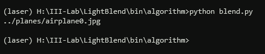
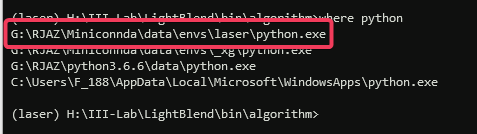
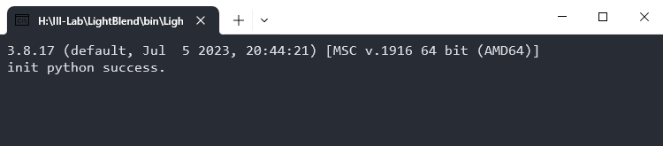
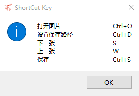
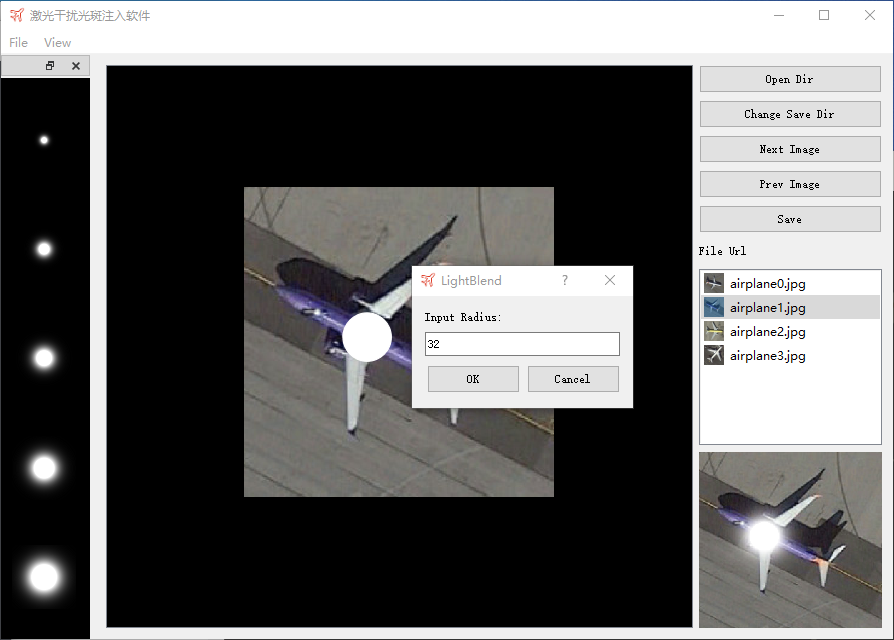
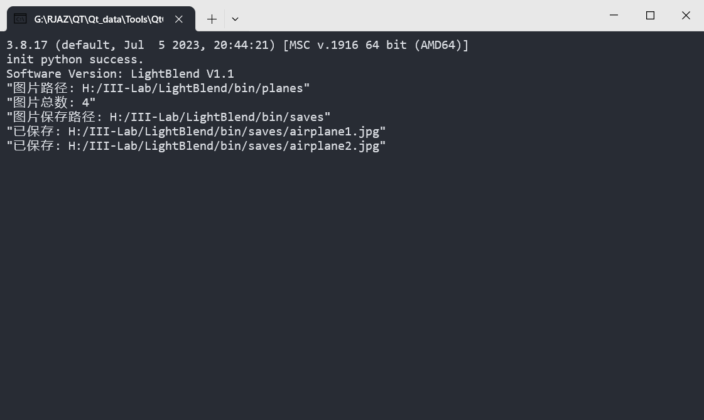

## 增加新元素

1. 在dockwiget中添加新元素，只需要在items.txt中新增一行，并且在文件夹中放置对应的png图片即可，显示的顺序按照在txt文件中的顺序

## 参考

1. [QT反射](https://juejin.cn/post/7113839621661786126)


## 环境部署

1. 创建conda环境并激活

   ```shell
   conda create -n laser python=3.8.17
   conda activate laser
   ```

2. 安装必要依赖

   ```shell
   pip install numpy==1.24.3
   pip install opencv-python==4.7.0.72
   pip install torch==2.0.1
   ```

3. 测试该环境是否能运行`blend.py`算法

   

4. 修改python解释器路径

   1. 终端输入`where python`，复制环境laser的路径`G:\RJAZ\Miniconnda\data\envs\laser`

      

   2. 打开`config.ini`文件，将解释器路径复制进去，并修改未双反斜杠

      

5. 双击`LightBlend.exe`即可运行，显示`success`即可

​		


## 软件界面






